# CookTopia

CookTopia is an imaginary e-commerce site, selling modern, functional kitchenware. Currently, the e-store specializes in selling knives, pots, pans, and some extra accessories with the intention of expanding the scope.

Our target customers are anyone in need of functional, modern, high-quality products for domestic or professional use.

[CookTopia live project here.](https://cooktopia-3a5b4620860d.herokuapp.com/)


## Table of Contents

- [UI/UX](#uiux)
    - [Agile Development](#agile-development)
      - [MoSCoW Prioratization](#moscow-prioratization)
    - [User Stories](#user-stories)
    - [Wireframes](#wireframes)
    - [Site Goals](#site-goals)
    - [Design Choices](#design-choices)

- [Database Design](#database-design)
    - [Database Model](#database-model)
    - [Custom Models](#custom-models)

- [Features](#features)
    - [Home Page](#home-page)
    - [Navbar](#navbar)
    - [Footer](#footer)
    - [My Account](#my-account)
    - [Product Management](#product-management)
    - [My Profile](#my-profile)
    - [Wishlist](#wishlist)
    - [Shopping Bag](#shopping-bag)
    - [Secure Checkout](#secure-checkout)
    - [Thank You Page](#thank-you-page)
    - [Search Bar](#search-bar)
    - [All Products Page](#all-products-page)
    - [Product Page](#product-page)
    - [Review Section](#review-section)
    - [Authentication](#authentication)
    - [Password Reset](#password-reset)
    - [Additional Features](#additional-features)
    - [404 Page](#404-page)
    - [Future Features](#future-features)

- [Business Model](#business-model)
- [Marketing Strategy](#marketing-strategy)
    - [Social Media Marketing](#social-media-marketing)
    - [Newsletter Marketing](#newsletter-marketing)
- [Search Engine Optimization](#search-engine-optimization)
    - [Keywords](#keywords)
    - [Meta Tags](#meta-tags)
    - [Sitemap.xml](#sitemapxml)
    - [Robots.txt](#robotstxt)

- [Technologies Used](#technologies-used)
    - [Languages](#languages)
    - [Frameworks and Libraries](#frameworks-and-libraries)
    - [Tools](#tools)

- [Testing](#testing)
    - [Test Guide](#test-guide)
    - [Validator Testing](#validator-testing)
    - [Browser Testing](#browser-testing)
    - [Fixed Bugs](#fixed-bugs)
    - [Unfixed Bugs](#unfixed-bugs)

- [Deployment](#deployment)

- [Development](#development)
    - [Fork](#fork)
    - [Clone](#clone)
    - [Download ZIP](#download-as-zip)

- [Source Credits](#source-credits)
    - [References/Documentation/Tutorials](#referencesdocumentationtutorials)
    - [Media and Styling](#media-and-styling)
    - [Content/Data](#contentdata)

## UI/UX

The design of the site is pretty simplistic yet modern I would say, with the easy-to-see navbar presenting the products the site is offering. The site follows a mostly black-and-white theme, where the fancy shade of red was used for some detailing.

The main background shows the first-time visitor what the site is about, and that the site is for those who cook with passion and expect nothing but quality.

The site is fully responsive, making it easy to use on phones as well as on PCs.

### Agile Development

The site is developed according to the Agile Methodology, where the GitHub Project feature was used to utilize the Kanban board for this purpose.

While developing, I chose one issue to work on from the "Todo" column of the Kanban board and moved it into the "In Progress" column.

After I was done with the issue by fulfilling all the acceptance criteria, I moved the issue into the "Done" Column.

#### MoSCoW Prioratization

I chose to follow the MoSCoW Prioritization method to label my issues(user stories/features):
  - Must Have
  - Should Have
  - Could Have
  - Won't Have

The Must Have having the highest priority, next being Should Have and then Could Have, Won't Have presenting the features not being implemented at this point and time.

[Back to Top](#table-of-contents)

### User Stories
| User Story | Priority |
|------------|------------------|
| As a ***customer***, I can ***view listed products***, so that ***I can find something to buy***. | **MUST HAVE** |
| As a ***customer***, I can ***view a detailed preview of the product***, so that ***I can get more information about it(price, description, image...)***. | **MUST HAVE** |
| As a ***customer***, I can ***search for the desired product by name or description***, so that ***I can find the specific product I want to buy***. | **MUST HAVE** |
| As a ***customer***, I can ***see the total cost of the items in my bag***, so that ***I can see if I am getting out of my budget***. | **MUST HAVE** |
| As a ***customer***, I can ***sort specific categories of products***, so that ***I can find the cheapest/best-rated product in the given category***. | **SHOULD HAVE** |
| As a ***customer***, I can ***sort the list of products***, so that ***I can easily find the best-priced/best-rated one***. | **SHOULD HAVE** |
| As a ***customer***, I can ***change the quantity of the added items within the shopping bag***, so that ***I can add/remove specific items if desired***. | **SHOULD HAVE** |
| As a ***customer***, I can ***easily view the items added to my shopping bag***, so that ***I can have an overview of the all items added and total cost***. | **MUST HAVE** |
| As a ***customer***, I can ***select the quantity of the products***, so that ***I can be sure to add the right quantity of the products to my shopping bag***. | **MUST HAVE** |
| As a ***customer***, I can ***enter my payment information***, so that ***I can checkout easily without any issues***. | **MUST HAVE** |
| As a ***customer***, I can ***have insight into the order confirmation details***, so that ***I can be sure I made no mistakes***. | **SHOULD HAVE** |
| As a ***customer***, I can ***get registered***, so that ***I can have a personal account/profile***. | **MUST HAVE** |
| As a ***customer***, I can ***view my profile***, so that ***I can view my order history and save/update shipping/paying information***. | **SHOULD HAVE** |
| As a ***customer***, I can ***receive the confirmation email***, so that ***I can be sure everything went well and keep it for just in case***. | **SHOULD HAVE** |
| As a ***customer***, I can ***receive email confirmation after filling in the register form***, so that ***I can verify my account registration was successful***. | **SHOULD HAVE** |
| As a ***customer***, I can ***add items to wishlist***, so that ***I don't need to search for them all over again when I decide to buy them***. | **SHOULD HAVE** |
| As a ***customer***, I can ***recover my password***, so that ***I can get access to my account in case I forget my password***. | **SHOULD HAVE** |
| As a ***customer***, I can ***rate the product I already bought***, so that ***I can leave positive/negative feedback***. | **SHOULD HAVE** |
| As a ***customer***, I can ***see if there are any special offers/deals***, so that ***I can enjoy the discounted price and save some money***. | **WON'T HAVE** |
| As a ***admin***, I can ***perform CRUD operations***, so that ***I can manipulate the site as desired***. | **MUST HAVE** |

[Back to Top](#table-of-contents)

### Wireframes

I have created wireframes within [Balsamiq](https://balsamiq.com/) to get initial idea of how the site will look like.

- #### Mobile and Tablet
  

    <details>
    <summary>Home Page
    </summary>

    
    </details>

    <details>
    <summary>Shop
    </summary>

    
    </details>

    <details>
    <summary>Product
    </summary>

    
    </details>

    <details>
    <summary>Shopping Bag
    </summary>

    
    </details>

    <details>
    <summary>Shopping Bag Empty
    </summary>

    
    </details>

    <details>
    <summary>Checkout
    </summary>

    
    </details>

    <details>
    <summary>Order Confirmed
    </summary>

    
    </details>

    <details>
    <summary>Profile Details
    </summary>

    
    </details>

    <details>
    <summary>Sign Up
    </summary>

    
    </details>

    <details>
    <summary>Sign In
    </summary>

    
    </details>

    <details>
    <summary>Sign Out
    </summary>

    
    </details>

    <details>
    <summary>Wishlist
    </summary>

    
    </details>

- #### Desktop

    <details>
    <summary>Home Page
    </summary>

    
    </details>

    <details>
    <summary>Shop
    </summary>

    
    </details>

    <details>
    <summary>Product
    </summary>

    
    </details>

    <details>
    <summary>Shopping Bag
    </summary>

    
    </details>

    <details>
    <summary>Shopping Bag Empty
    </summary>

    
    </details>

    <details>
    <summary>Checkout
    </summary>

    
    </details>

    <details>
    <summary>Order Confirmed
    </summary>

    
    </details>

    <details>
    <summary>Profile Details
    </summary>

    
    </details>

    <details>
    <summary>Sign Up
    </summary>

    
    </details>

    <details>
    <summary>Sign In
    </summary>

    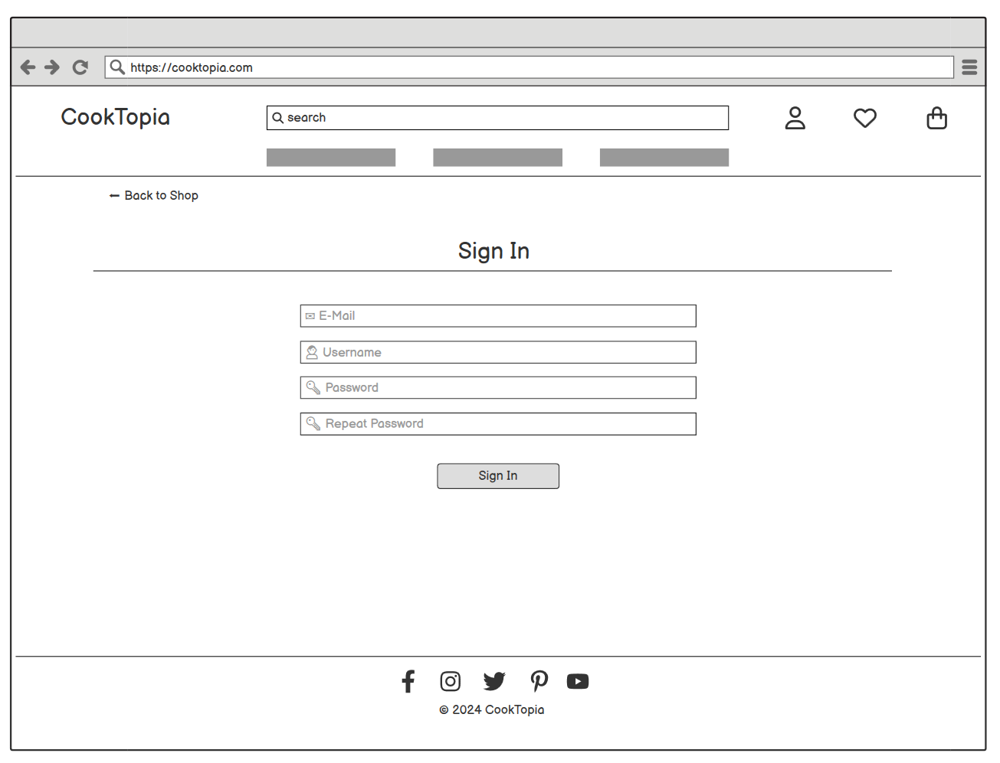
    </details>

    <details>
    <summary>Sign Out
    </summary>

    
    </details>

    <details>
    <summary>Wishlist
    </summary>

    
    </details>

[Back to Top](#table-of-contents)

### Site Goals

CookTopia is an e-commerce site offering a variety of kitchenware. It is currently focused on knives, pots, pans, and a few extra accessories. Customers are able to pay with cards thanks to the implemented Stripe payment system and get the products delivered to their door.

CookTopia is still in the growing phase with the intention of expanding the range of products offered, focusing on modern design, functionality, and above everything, high quality of products.

Simply said the goal is to become the final destination for those searching for high-quality kitchenware products.

[Back to Top](#table-of-contents)

### Design Choices

#### Color Scheme

The site uses a kind of minimalistic approach, using black and white throughout the the site, gray for some hover effects, and a fancy shade of red for some extra details such as within the logo itself, delivery banner, and some buttons.


#### Font and Icons

The font used is [Lato](https://fonts.google.com/specimen/Lato?query=Lato), from Google Fonts, which is a versatile, open-source humanist sans-serif font family that has gained immense popularity for its warmth, legibility, and multilingual support across print and digital mediums.

Icons used are from the [Font Awesome](https://fontawesome.com/icons) free packet of icons.

#### Images

Images used for the products are taken artistically for a nice presentation, with an attempt to bring the practicality of the products closer to the customers.

[Back to Top](#table-of-contents)

## Database Design

### Database Model

The database model or so-called ERD(entity relationship diagram) was created to visualize the connection between models within the project. The diagram was created using Drawsql.app, here is the link to the diagram itself: [CookTopia-ERD](https://drawsql.app/teams/alexs-team-145/diagrams/cooktopia).

<details>
<summary>CookTopia - ERD
</summary>


</details>

### Custom Models

The custom models made for this project were:
 - Product(extended BoutiqueAdo's model)
 - ReviewRating
 - Wishlist

[Back to Top](#table-of-contents)

## Features

### Home Page


- The landing page consists of Navbar, Main Section where we can find Shop Now button which takes us to the list of all products present at the site, Newsletter sign up option from MailChimp as well as Footer at the bottom of the page.

[Back to Top](#table-of-contents)

### Navbar
- Desktop


- Mobile-Collapsed


- Mobile-Open


- Navbar is fully responsive. Here we can find:
  - Logo, which acts as a Home button
  - Search Bar
  - My Account Icon
  - Wishlist Icon
  - Shopping Bag Icon, with total amount under it
  - Burger Icon on small and medium screens
  - Home button for smaller and medium screens

[Back to Top](#table-of-contents)

### Footer

- Desktop


- Mobile


- The Footer is pretty simple and self explanatory.
- The Footer is present at every page.
- The Links towards the social networks are being opened within the new tab as good UX practices.

[Back to Top](#table-of-contents)

### My Account

- Not Authenticated


- Authenticated


- My Account section is a drop-down with few different options for the authenticated and not authenticated user as well as Product Managment Tab for the admins.

[Back to Top](#table-of-contents)

### Product Management


- Product Management is a page available to the admins, which enables them to add the products to the e-store.

[Back to Top](#table-of-contents)

### My Profile


- This page consist of 2 sections:
  - Delivery Informations, which is there to store personal info about the users, address, number, country...
  - Order History, contains all of the previous orders, if there are any.

[Back to Top](#table-of-contents)

### Wishlist

- Empty


- Not Empty

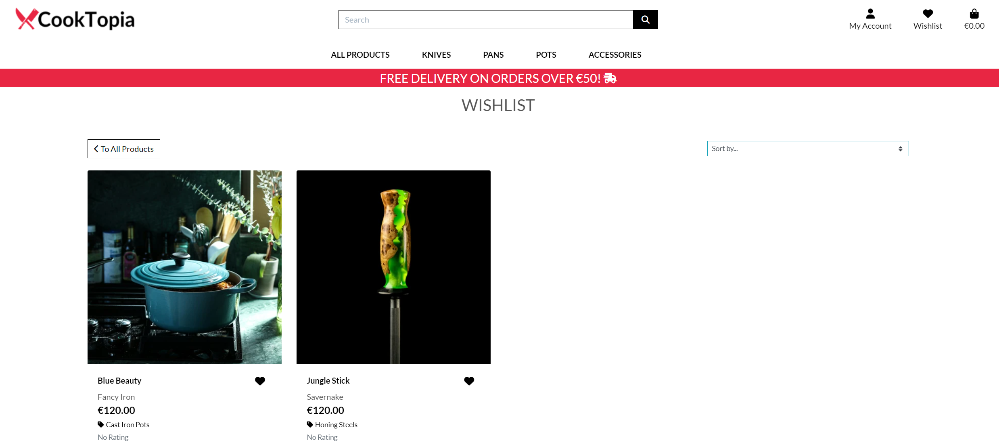

- Wishlist is an feature coming handy for storing desired items for some future purchase. The products can be removed from the wishlist as well by clicking on the heart icon.

[Back to Top](#table-of-contents)

### Shopping Bag

- Empty


- Not Empty


- Shopping Bag is a page, where we can see details of the added items and cost of the planned purchase.
- We are also able to directly change the quantity of item/s to buy or completely remove them if needed.
- We can also continue shopping by clicking on the Keep Shopping button or proceed to Secure Checkout by pressing the aforementioned button.

[Back to Top](#table-of-contents)

### Secure Checkout

- Checkout consists of 2 sections:
  - Left Side, where we need to enter personal and delivery details, as well as payment details at the bottom
  - Right Side, where we have Order Summary once again to ensure everything is as desired.


- Payment Details, here we need to enter the card number, date of expiration and bic/swift code.


- Here is an example of the testing the payment process, provided by Stripe. For this testing to work the month must be the present one or any month in the future.


- Loading process/making payment, symbolically presented with a loading symbol, letting the customer know that the order is being processed.


[Back to Top](#table-of-contents)

### Thank You Page

- After the successfully placed order, the customer is taken to the Thank You Page, where once again he/she is being presented with the order summery.
- At the bottom is the Checkout Other Products button in case the customer wants to keep on searching through the site.
- The Customer is also being informed that the confirmation e-mail has been sent to the provided e-mail address.


[Back to Top](#table-of-contents)

### Search Bar
- No Search Criteria, in case someone clicks on search without typing in anything, the toast message will pop out.


- No Matching, the look of the search page in case there are no matches. With the small line of text saying:"0 Products found for..."


- Products Found, the look of the search page in case at least 1 product has been founded, in this case the line informs us that:"3 Products found for..."


[Back to Top](#table-of-contents)

### All Products Page

- By clicking on the All Products drop-down menu, we can choose to open the All Products page, sorting by one of the given criteria.
- Similarly we can open one of the other sections, be it a Knives, Pans, Pots or Accessories.


- All Products Page, lists all of the present products at the site, with possibility of sorting the products by:
  - Price
  - Rating
  - Name
  - Brand
  - Category

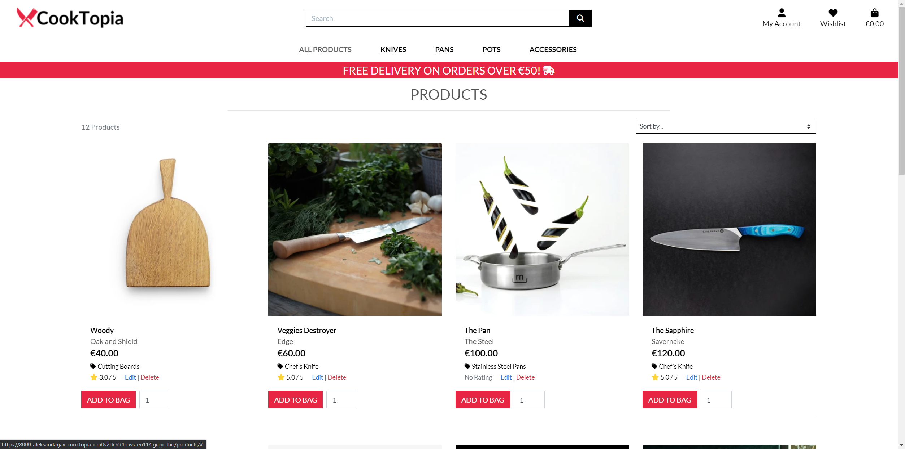

- Under the picture of each product is a small section, where we can find:
  - Product Name
  - Brand
  - Price in €
  - Badge, representing the group of products
  - Rating
  - Edit/Delte Buttons (only for admins)
  - Add To Bag button
  - Quantity Button
  - Heart Icon, acting as add to wishlist button

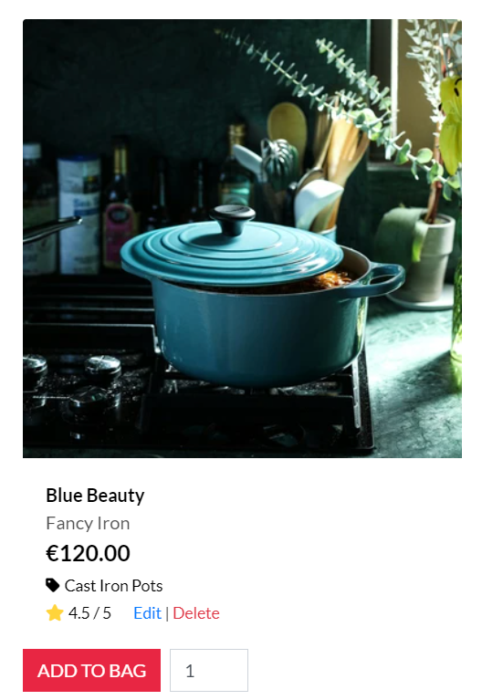

- Edit button takes the Admin to the Product Management page, in case some changes need to be done.
- Delete button, deletes the product from the e-store.

[Back to Top](#table-of-contents)

### Product Page

- This page contains all info about the product as well as Review/Comment section under the Product.
- The info about the Product from the All Products page is extended, and here we have added Description and Product Info.
- Under the Product Info, we have:
  - Material
  - Diametar
  - Volume
  - Country of Origin


[Back to Top](#table-of-contents)

### Review Section

- This section can be found under the Product Info on the Product Page.
- In case the customer is authenticated and the given product is already in his order history, meaning he/she has already bought the product, the customer can leave a review.


- Authenticated, but the product is not in the order history


- Authenticated, the product is in the order history


- Not Authenticated


[Back to Top](#table-of-contents)

### Authentication

- Depending on the status of the site user, different options will be rendered.
- Not Authenticated users will see the option to Log In or Register
- Authenticated users will have the option to Logout
- The pages to Sign Up, Sign In, and Sign Out are pretty self-explanatory.

- Sign Up


- Sign In


- Sign Out


[Back to Top](#table-of-contents)

### Password Reset

- In case the customer forgets the password, there is a feature for password recovery.
- It can be accessed from the Sign In Page, by clicking the `Forgot Password?` link.

- Password Reset Form


- Password Reseted, the info customer gets after he clicks `Reset My Password` button. At this moment the e-mail to reset the password is being sent to the customer.


- Password Change, the page customer is redirected to from the password reset e-mail.


- Password Changed, the page the customer lands on after the customer types in new passwords 2 times and clicks on the `Change Password` button.


[Back to Top](#table-of-contents)

### Additional Features

- Successful Registration 


- Registration E-Mail Confirmation, the page the user lands on after clicking on the confirmation link within the registration confirmation e-mail.

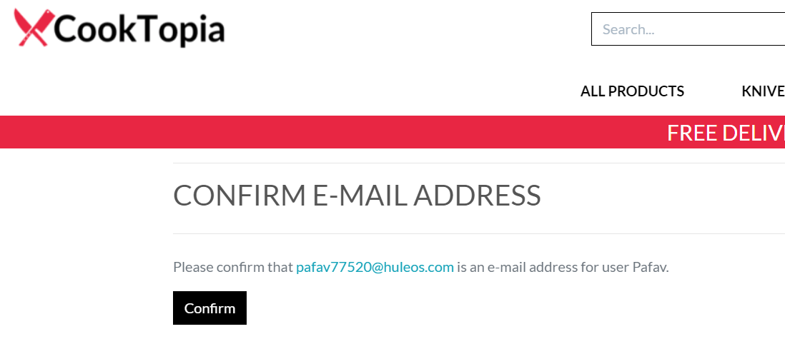

- Product Badges, cards/links preseting groups of products, can be found at pages as Knives, Pots, Pans, and Accessories.


[Back to Top](#table-of-contents)

### 404 Page

- The page that is rendered in case the user tries to open a non-existing page or simply appends `/404` to the address of the site.


[Back to Top](#table-of-contents)

### Future Features

- A blog could be added, as a way of presenting the products to future customers to help them decide if the given product is the right one for them.

- About Us Page, could be used to describe CookTopia as a reliable provider of high-quality kitchenware.

- Some kind of counter where the staff, as well as customers, can see the most sold items.

- The sales page could be used to introduce the discount possibilities.

[Back to Top](#table-of-contents)

### Business Model

- The Site CookTopia is an e-commerce store, operating on the principles of Business to Customer model(B2C). For the sake of practicality, the site is designed so that both authenticated and non-authenticated users can make purchases.

[Back to Top](#table-of-contents)

### Marketing Strategy

#### Social Media Marketing
- The main task of this page on the social network Facebook is to inform others about our new products, as well as place targeted advertising.

  <details>
  <summary>Facebook Marketing First
  </summary>

  
  </details>

  <details>
  <summary>Facebook Marketing Second
  </summary>

  
  </details>


#### Newsletter Marketing
- At the Home Page is the Mailchimp newsletter form, where the customers can subscribe and get informed about the new arrivals.

  <details>
  <summary>Mailchimp Marketing
  </summary>

  
  </details>

[Back to Top](#table-of-contents)

### Search Engine Optimization

#### Keywords

- I tested several long-tail keywords using the websites [Wordtracker](https://www.wordtracker.com/), [Moz](https://moz.com/). Most keywords showed low volume and competition.

  <details>
  <summary>Keyword - Moz
  </summary>

  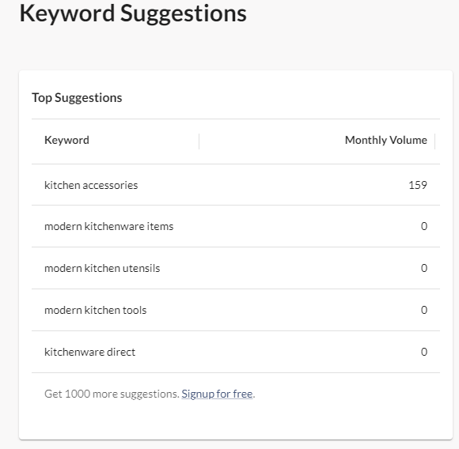
  </details>

  <details>
  <summary>Keyword - Wordtracker First
  </summary>

  
  </details>

  <details>
  <summary>Keyword - Wordtracker Second
  </summary>

  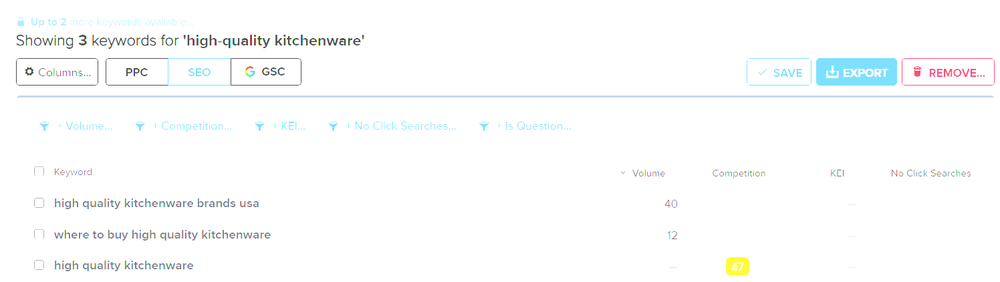
  </details>


#### Meta Tags

- In the head of base.html, under the Meta Tags section `<meta name="description"` ... and `<meta name="keywords"` ... tags were included.

#### Sitemap.xml

- I created a sitemap.xml file using [XML-Sitemaps](https://www.xml-sitemaps.com/), for the SEO improvements.

#### Robots.txt

- I created robots.txt file.

  <details>
  <summary>Robots.txt
  </summary>

  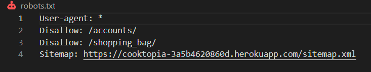
  </details>

- The file instructs search engines which directories not to crawl and index. It also links to the sitemap. The existence of this file signals a level of quality to search engines and so improves SEO ranking as a result.

[Back to Top](#table-of-contents)

## Technologies Used

### Languages

- HTML
- CSS
- Python
- Javascript

[Back to Top](#table-of-contents)

### Frameworks and Libraries

- [Django v3.2](https://docs.djangoproject.com/en/4.2/releases/3.2/) developement framework
- [Bootstrap v4.6](https://getbootstrap.com/docs/4.6/getting-started/introduction/) for template rendering
- [AllAuth v0.41](https://django-allauth.readthedocs.io/) for authentication
- [django-crispy-forms v1.14.0](https://pypi.org/project/crispy-bootstrap4/) for form rendering
- [boto3 v1.34.86](https://boto3.amazonaws.com/v1/documentation/api/latest/index.html) for AWS CRUD with Python scripts
- [dj-database-url v0.5.0](https://pypi.org/project/dj-database-url/) for DATABASE_URL
- [django-countries v7.2.1](https://pypi.org/project/django-countries/) for country field rendering in checkout form
- [django-storages v1.14.2](https://django-storages.readthedocs.io/en/latest/) for handling static and media files
- [gunicorn v22.0.0](https://docs.djangoproject.com/en/4.2/howto/deployment/wsgi/gunicorn/) apure-Python WSGI server for UNIX
- [oauthlib v3.2.2](https://pypi.org/project/oauthlib/) OAuth request-signing logic
- [psycopg2 v2.9.9](https://pypi.org/project/psycopg2/) s PostgreSQL database adapter for Python
- [Stripe v9.1.0](https://stripe.com/en-ie) for payment system

[Back to Top](#table-of-contents)

### Tools

- [Balsamiq](https://balsamiq.com/) used to create wireframes
- [Drawsql.app](https://drawsql.app/) used to create ERD
- [GitPod](https://gitpod.io/) used as IDE
- [Git](https://git-scm.com/) used for version control
- [GitHub](https://github.com/) used for online storage of codebase and projects tool
- [Heroku](https://heroku.com/) used for site hosting
- [AWS - Amazon Web Services (S3)](https://aws.amazon.com/) used to host static and media files
- [Image Resizer](https://www.simpleimageresizer.com/) used for handling the images(resizing, cropping, formating...)
- [Favicon](https://favicon.io/) used to create favicon
- [Amiresponsive](https://ui.dev/amiresponsive) used to create a mockup image of the CookTopia site
- [Perplexity AI](https://www.perplexity.ai/) used for debugging and problem solving
- [Slack](https://slack.com/) used for connecting as well as debugging and problem-solving during development
- [Mailchimp](https://mailchimp.com/) used for newsletter subscription service
- [Gmail](https://mail.google.com/) used for real e-mail sending
- [XML Sitemaps](https://www.xml-sitemaps.com/) used to generate sitemap.xml file
- [Privacy Policy Generator](https://www.privacypolicygenerator.info/) used to create policy

[Back to Top](#table-of-contents)

## Testing

## Deployment

A live version of the site is deployed to [Heroku](https://www.heroku.com/) and can be found here: [CookTopia](https://cooktopia-3a5b4620860d.herokuapp.com/).

### PostgreSQL from Code Institute

- Since the recent change at ElephantSQL, I've decided to go with the database CI provided for us.
- To make the database for the project, the steps are next:
- First go to [PostgreSQL from Code Institute](https://dbs.ci-dbs.net/), enter your e-mail address and click submit.

  <details>
    <summary>Step 1
    </summary>

    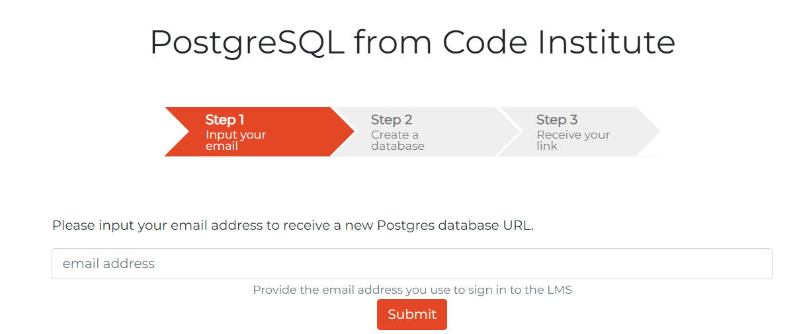
  </details>

- Your database will get generated automatically and you will receive an e-mail with the info about your database.

  <details>
    <summary>Step 2
    </summary>

    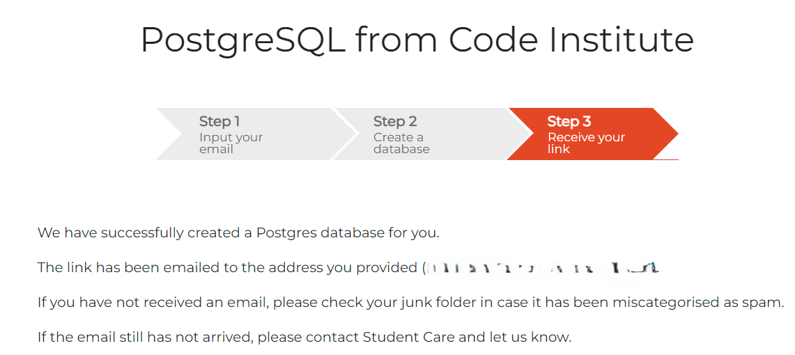
  </details>

- Within the e-mail, you will have a link to your database dashboard. Here you can see all of the needed information about your database or delete them if you'd like to.

  <details>
    <summary>Step 3
    </summary>

    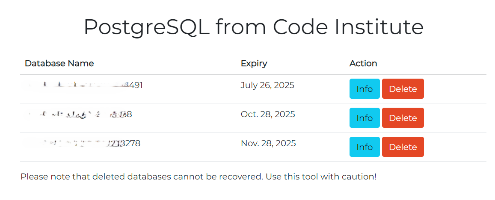
  </details>

- After you click the `Info` button, a list with all the needed information will pop up.

  <details>
    <summary>Step 4
    </summary>

    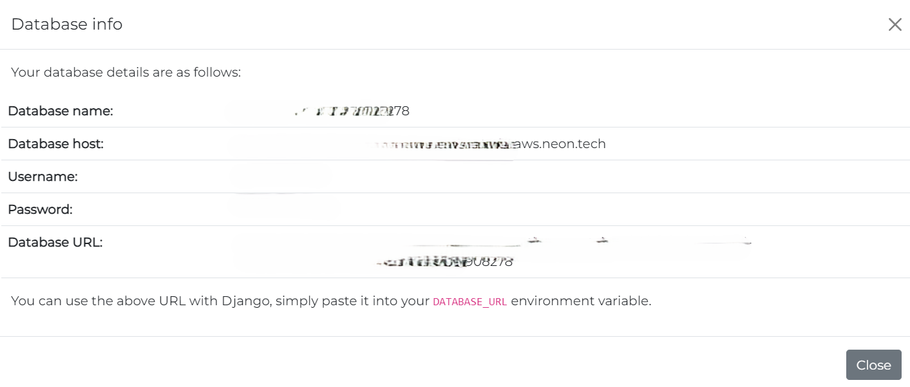
  </details>

[Back to Top](#table-of-contents)

### Heroku Deployment

#### Preparation

- Before the deployment, the following steps were taken to prepare the application for the deployment on Heroku:

- The setting `DEBUG` in the settings.py has to be set to `FALSE`. 
- It was achieved by the next lines:
- Within `settings.py`:
    ````
      import os
      import dj_database_url
      if os.path.isfile('env.py'):
          import env
    ````
    ````
      DEBUG = 'DEVELOPMENT' in os.environ
    ````
- Within `env.py`:
    ````
      os.environ["DEVELOPMENT"] = 'False'
    ````
- All the dependencies were stored in the requirements.txt file with the command `pip3 freeze --local > requirements.txt`.
- The start command for the application `web: gunicorn cooktopia.wsgi:application` was stored in a Procfile.


#### Deployment

1. Go to [Heroku](https://id.heroku.com/login), create account if you don't have and log in.

2. Head to your dashboard and click `New`, then `Create new app`

    <details>
    <summary>New/CreateNewApp
    </summary>
              
    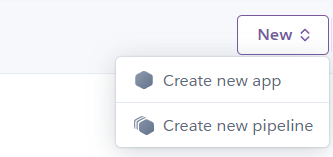
    </details>

3. Next step is to give your app a name and to choose region. After that click on `Create app`.

    <details>
    <summary>Name/Region/Create
    </summary>
              
    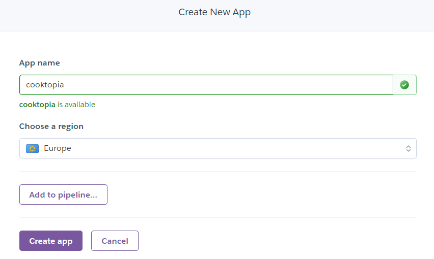
    </details>

4. After that head to `Settings` tab which you can find on top of your Heroku page and under the `Config Vars` set your Key/Value Pairs.

    <details>
    <summary>Config Vars
    </summary>
              
    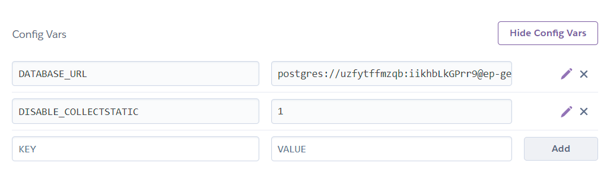
    </details>

5. Then in the `Buildpacks` section you will need to add buildpacks. In this case `Heroku/Python` was already set, so I didn't need to change anything.

    <details>
    <summary>Buildpacks
    </summary>
              
    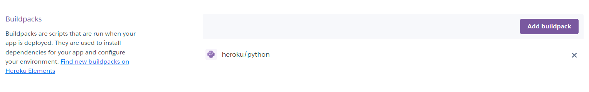
    </details>

6. Then head to the `Deployment` tab which you can also find on top of your Heroku page and under `Deployment method` click on `GitHub`(in my case that's where my repository is).

    <details>
    <summary>GitHub
    </summary>
              
    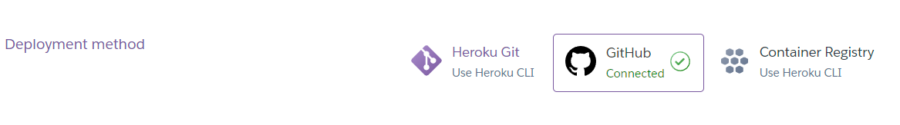
    </details>

7. After that, just under the `Deployment method` section is `Connect to GitHub` section where you need to find your repository and then click on `Connect`.

    <details>
    <summary>Connect
    </summary>
              
    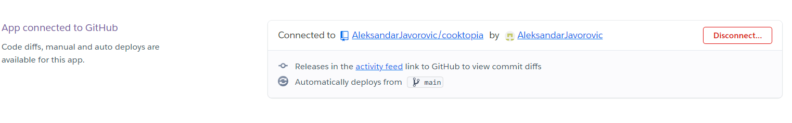
    </details>

8. Just under `Connect to GitHub` section is `Automatic deploys` section where you can click on `Enable Automatic Deploys` if that's what you want and just under is `Manual Deploy` section, where you need to click on `Deploy Manually`.

    <details>
    <summary>Enable Automatic Deploys
    </summary>
              
    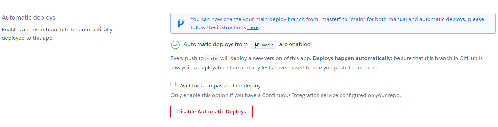
    </details>

    <details>
    <summary>Deploy Manually
    </summary>
              
    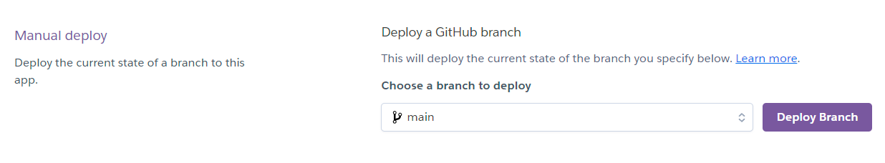
    </details>

[Back to Top](#table-of-contents)


## Development

## Credits