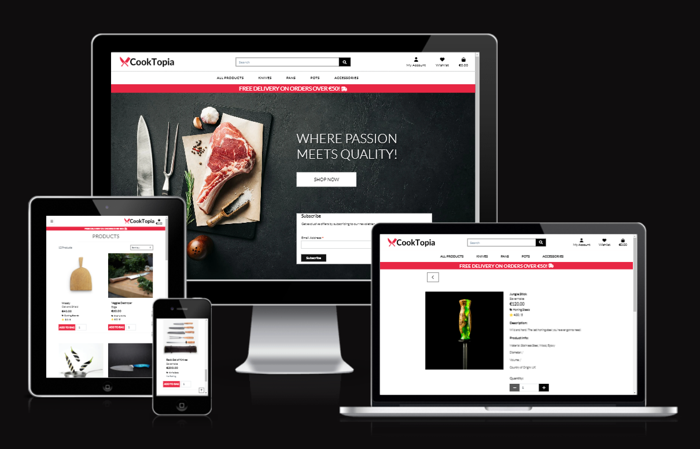

# CookTopia

CookTopia is an imaginary e-commerce site, selling modern, functional kitchenware. Currently, the e-store specializes in selling knives, pots, pans, and some extra accessories with the intention of expanding the scope.

Our target customers are anyone in need of functional, modern, high-quality products for domestic or professional use.

[CookTopia live project here.](https://cooktopia-3a5b4620860d.herokuapp.com/)

## Table of Contents

- [UI/UX](#uiux)
    - [Agile Development](#agile-development)
      - [MoSCoW Prioratization](#moscow-prioratization)
    - [Wireframes](#wireframes)
    - [Site Goals](#site-goals)
    - [Design Choices](#design-choices)

- [User Stories](#user-stories)

- [Database Design](#database-design)
    - [Database Model](#database-model)
    - [Custom Model](#custom-model)
    - [CRUD](#crud)

- [SEO and Marketing](#seo-and-marketing)

- [Features](#features)
    - [Existing Features](#existing-features)
    - [Future Features](#possible-future-features)

- [Technologies Used](#technologies-used)
    - [Work Environments and Hosting](#work-environments-and-hosting)
    - [Python Libraries](#python-libraries)
    - [Django Libraries](#django-libraries)
    - [Payment processing](#payment-processing)
    - [Emails/Newsletter](#emailsnewsletter)
    - [SEO/Marketing](#seomarketing)

- [Testing](#testing)
    - [Test Guide](#test-guide)
    - [Validator Testing](#validator-testing)
    - [Browser Testing](#browser-testing)
    - [Fixed Bugs](#fixed-bugs)
    - [Unfixed Bugs](#unfixed-bugs)

- [Deployment](#deployment)

- [Development](#development)
    - [Fork](#fork)
    - [Clone](#clone)
    - [Download ZIP](#download-as-zip)

- [Source Credits](#source-credits)
    - [References/Documentation/Tutorials](#referencesdocumentationtutorials)
    - [Media and Styling](#media-and-styling)
    - [Content/Data](#contentdata)

## UI/UX

The design of the site is pretty simplistic yet modern I would say, with the easy-to-see navbar presenting the products the site is offering. The site follows a mostly black-and-white theme, where the fancy shade of red was used for some detailing.

The main background shows the first-time visitor what the site is about, and that the site is for those who cook with passion and expect nothing but quality.

The site is fully responsive, making it easy to use on phones as well as on PCs.

### Agile Development

The site is developed according to the Agile Methodology, where the GitHub Project feature was used to utilize the Kanban board for this purpose.

While developing, I chose one issue to work on from the "Todo" column of the Kanban board and moved it into the "In Progress" column.

After I was done with the issue by fulfilling all the acceptance criteria, I moved the issue into the "Done" Column.

#### MoSCoW Prioratization

I chose to follow the MoSCoW Prioritization method to label my issues(user stories/features):
  - Must Have
  - Should Have
  - Could Have
  - Won't Have

The Must Have having the highest priority, next being Should Have and then Could Have, Won't Have presenting the features not being implemented at this point and time.

### Wireframes

I have created wireframes within [Balsamiq](https://balsamiq.com/) to get initial idea of how the site will look like.

- #### Mobile and Tablet
  

    

    
Home Page
    

    
    

    

    
Shop
    

    
    

    

    
Product
    

    
    

    

    
Shopping Bag
    

    
    

    

    
Shopping Bag Empty
    

    
    

    

    
Checkout
    

    
    

    

    
Order Confirmed
    

    
    

    

    
Profile Details
    

    
    

    

    
Sign Up
    

    
    

    

    
Sign In
    

    
    

    

    
Sign Out
    

    
    

    

    
Wishlist
    

    
    

- #### Desktop

    

    
Home Page
    

    
    

    

    
Shop
    

    
    

    

    
Product
    

    
    

    

    
Shopping Bag
    

    
    

    

    
Shopping Bag Empty
    

    
    

    

    
Checkout
    

    
    

    

    
Order Confirmed
    

    
    

    

    
Profile Details
    

    
    

    

    
Sign Up
    

    
    

    

    
Sign In
    

    
    

    

    
Sign Out
    

    
    

    

    
Wishlist
    

    
    

### Site Goals

CookTopia is an e-commerce site offering a variety of kitchenware. It is currently focused on knives, pots, pans, and a few extra accessories. Customers are able to pay with cards thanks to the implemented Stripe payment system and get the products delivered to their door.

CookTopia is still in the growing phase with the intention of expanding the range of products offered, focusing on modern design, functionality, and above everything, high quality of products.

### Design Choices

#### Color Scheme

The site uses a kind of minimalistic approach, using black and white throughout the site, gray for some hover effects, and a fancy shade of red for some extra details such as within the logo itself.

#### Font and Icons

Font used is [Lato](https://fonts.google.com/specimen/Lato?query=Lato), from Google Fonts, which is a versatile, open-source humanist sans-serif font family that has gained immense popularity for its warmth, legibility, and multilingual support across print and digital mediums.

Icons used are from the [Font Awesome](https://fontawesome.com/icons) free packet of icons.
