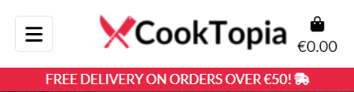
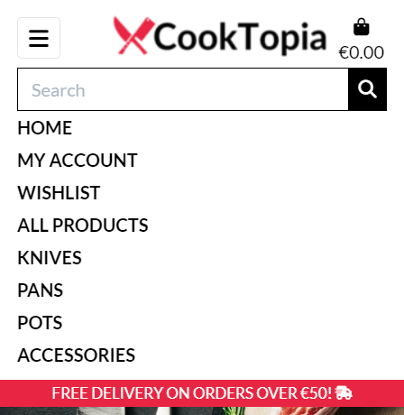
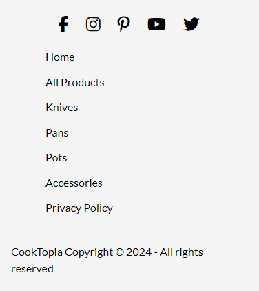

# CookTopia

CookTopia is an imaginary e-commerce site, selling modern, functional kitchenware. Currently, the e-store specializes in selling knives, pots, pans, and some extra accessories with the intention of expanding the scope.

Our target customers are anyone in need of functional, modern, high-quality products for domestic or professional use.

[CookTopia live project here.](https://cooktopia-3a5b4620860d.herokuapp.com/)

## Table of Contents

- [UI/UX](#uiux)
    - [Agile Development](#agile-development)
      - [MoSCoW Prioratization](#moscow-prioratization)
    - [User Stories](#user-stories)
    - [Wireframes](#wireframes)
    - [Site Goals](#site-goals)
    - [Design Choices](#design-choices)

- [Database Design](#database-design)
    - [Database Model](#database-model)
    - [Custom Models](#custom-models)

- [Features](#features)

- [SEO and Marketing](#seo-and-marketing)

- [Technologies Used](#technologies-used)
    - [Work Environments and Hosting](#work-environments-and-hosting)
    - [Python Libraries](#python-libraries)
    - [Django Libraries](#django-libraries)
    - [Payment processing](#payment-processing)
    - [Emails/Newsletter](#emailsnewsletter)
    - [SEO/Marketing](#seomarketing)

- [Testing](#testing)
    - [Test Guide](#test-guide)
    - [Validator Testing](#validator-testing)
    - [Browser Testing](#browser-testing)
    - [Fixed Bugs](#fixed-bugs)
    - [Unfixed Bugs](#unfixed-bugs)

- [Deployment](#deployment)

- [Development](#development)
    - [Fork](#fork)
    - [Clone](#clone)
    - [Download ZIP](#download-as-zip)

- [Source Credits](#source-credits)
    - [References/Documentation/Tutorials](#referencesdocumentationtutorials)
    - [Media and Styling](#media-and-styling)
    - [Content/Data](#contentdata)

## UI/UX

The design of the site is pretty simplistic yet modern I would say, with the easy-to-see navbar presenting the products the site is offering. The site follows a mostly black-and-white theme, where the fancy shade of red was used for some detailing.

The main background shows the first-time visitor what the site is about, and that the site is for those who cook with passion and expect nothing but quality.

The site is fully responsive, making it easy to use on phones as well as on PCs.

### Agile Development

The site is developed according to the Agile Methodology, where the GitHub Project feature was used to utilize the Kanban board for this purpose.

While developing, I chose one issue to work on from the "Todo" column of the Kanban board and moved it into the "In Progress" column.

After I was done with the issue by fulfilling all the acceptance criteria, I moved the issue into the "Done" Column.

#### MoSCoW Prioratization

I chose to follow the MoSCoW Prioritization method to label my issues(user stories/features):
  - Must Have
  - Should Have
  - Could Have
  - Won't Have

The Must Have having the highest priority, next being Should Have and then Could Have, Won't Have presenting the features not being implemented at this point and time.

### User Stories
| User Story | Priority |
|------------|------------------|
| As a ***customer***, I can ***view listed products***, so that ***I can find something to buy***. | **MUST HAVE** |
| As a ***customer***, I can ***view a detailed preview of the product***, so that ***I can get more information about it(price, description, image...)***. | **MUST HAVE** |
| As a ***customer***, I can ***search for the desired product by name or description***, so that ***I can find the specific product I want to buy***. | **MUST HAVE** |
| As a ***customer***, I can ***see the total cost of the items in my bag***, so that ***I can see if I am getting out of my budget***. | **MUST HAVE** |
| As a ***customer***, I can ***sort specific categories of products***, so that ***I can find the cheapest/best-rated product in the given category***. | **SHOULD HAVE** |
| As a ***customer***, I can ***sort the list of products***, so that ***I can easily find the best-priced/best-rated one***. | **SHOULD HAVE** |
| As a ***customer***, I can ***change the quantity of the added items within the shopping bag***, so that ***I can add/remove specific items if desired***. | **SHOULD HAVE** |
| As a ***customer***, I can ***easily view the items added to my shopping bag***, so that ***I can have an overview of the all items added and total cost***. | **MUST HAVE** |
| As a ***customer***, I can ***select the quantity of the products***, so that ***I can be sure to add the right quantity of the products to my shopping bag***. | **MUST HAVE** |
| As a ***customer***, I can ***enter my payment information***, so that ***I can checkout easily without any issues***. | **MUST HAVE** |
| As a ***customer***, I can ***have insight into the order confirmation details***, so that ***I can be sure I made no mistakes***. | **SHOULD HAVE** |
| As a ***customer***, I can ***get registered***, so that ***I can have a personal account/profile***. | **MUST HAVE** |
| As a ***customer***, I can ***view my profile***, so that ***I can view my order history and save/update shipping/paying information***. | **SHOULD HAVE** |
| As a ***customer***, I can ***receive the confirmation email***, so that ***I can be sure everything went well and keep it for just in case***. | **SHOULD HAVE** |
| As a ***customer***, I can ***receive email confirmation after filling in the register form***, so that ***I can verify my account registration was successful***. | **SHOULD HAVE** |
| As a ***customer***, I can ***add items to wishlist***, so that ***I don't need to search for them all over again when I decide to buy them***. | **SHOULD HAVE** |
| As a ***customer***, I can ***recover my password***, so that ***I can get access to my account in case I forget my password***. | **SHOULD HAVE** |
| As a ***customer***, I can ***rate the product I already bought***, so that ***I can leave positive/negative feedback***. | **SHOULD HAVE** |
| As a ***customer***, I can ***see if there are any special offers/deals***, so that ***I can enjoy the discounted price and save some money***. | **WON'T HAVE** |
| As a ***admin***, I can ***perform CRUD operations***, so that ***I can manipulate the site as desired***. | **MUST HAVE** |

### Wireframes

I have created wireframes within [Balsamiq](https://balsamiq.com/) to get initial idea of how the site will look like.

- #### Mobile and Tablet
  

    

    
Home Page
    

    
    

    

    
Shop
    

    
    

    

    
Product
    

    
    

    

    
Shopping Bag
    

    
    

    

    
Shopping Bag Empty
    

    
    

    

    
Checkout
    

    
    

    

    
Order Confirmed
    

    
    

    

    
Profile Details
    

    
    

    

    
Sign Up
    

    
    

    

    
Sign In
    

    
    

    

    
Sign Out
    

    
    

    

    
Wishlist
    

    
    

- #### Desktop

    

    
Home Page
    

    
    

    

    
Shop
    

    
    

    

    
Product
    

    
    

    

    
Shopping Bag
    

    
    

    

    
Shopping Bag Empty
    

    
    

    

    
Checkout
    

    
    

    

    
Order Confirmed
    

    
    

    

    
Profile Details
    

    
    

    

    
Sign Up
    

    
    

    

    
Sign In
    

    
    

    

    
Sign Out
    

    
    

    

    
Wishlist
    

    
    

### Site Goals

CookTopia is an e-commerce site offering a variety of kitchenware. It is currently focused on knives, pots, pans, and a few extra accessories. Customers are able to pay with cards thanks to the implemented Stripe payment system and get the products delivered to their door.

CookTopia is still in the growing phase with the intention of expanding the range of products offered, focusing on modern design, functionality, and above everything, high quality of products.

Simply said the goal is to become the final destination for those searching for high-quality kitchenware products.

### Design Choices

#### Color Scheme

The site uses a kind of minimalistic approach, using black and white throughout the the site, gray for some hover effects, and a fancy shade of red for some extra details such as within the logo itself, delivery banner, and some buttons.

#### Font and Icons

The font used is [Lato](https://fonts.google.com/specimen/Lato?query=Lato), from Google Fonts, which is a versatile, open-source humanist sans-serif font family that has gained immense popularity for its warmth, legibility, and multilingual support across print and digital mediums.

Icons used are from the [Font Awesome](https://fontawesome.com/icons) free packet of icons.

#### Images

Images used for the products are taken artistically for a nice presentation, with an attempt to bring the practicality of the products closer to the customers.

## Database Design

### Database Model

The database model or so-called ERD(entity relationship diagram) was created to visualize the connection between models within the project. The diagram was created using Drawsql.app, here is the link to the diagram itself: [CookTopia-ERD](https://drawsql.app/teams/alexs-team-145/diagrams/cooktopia).

CookTopia - ERD

### Custom Models

The custom models made for this project were:
 - Product(extended BoutiqueAdo's model)
 - ReviewRating
 - Wishlist

## Features

### Home Page

- The landing page consists of Navbar, Main Section where we can find Shop Now button which takes us to the list of all products present at the site, Newsletter sign up option from MailChimp as well as Footer at the bottom of the page.

### Navbar
- Desktop

- Mobile-Collapsed

- Mobile-Open

- Navbar is fully responsive. Here we can find:
  - Logo, which acts as a Home button
  - Search Bar
  - My Account Icon
  - Wishlist Icon
  - Shopping Bag Icon, with total amount under it
  - Burger Icon on small and medium screens
  - Home button for smaller and medium screens

### Footer

- Desktop

- Mobile

- Footer is pretty simple and self explanatory.