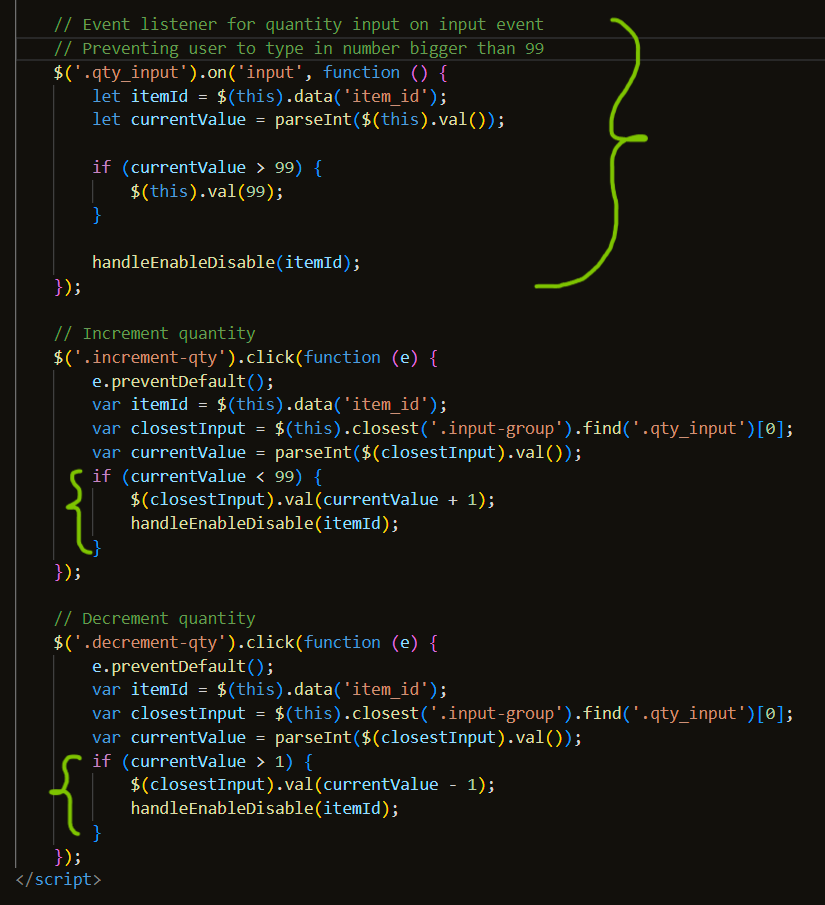
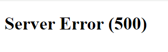
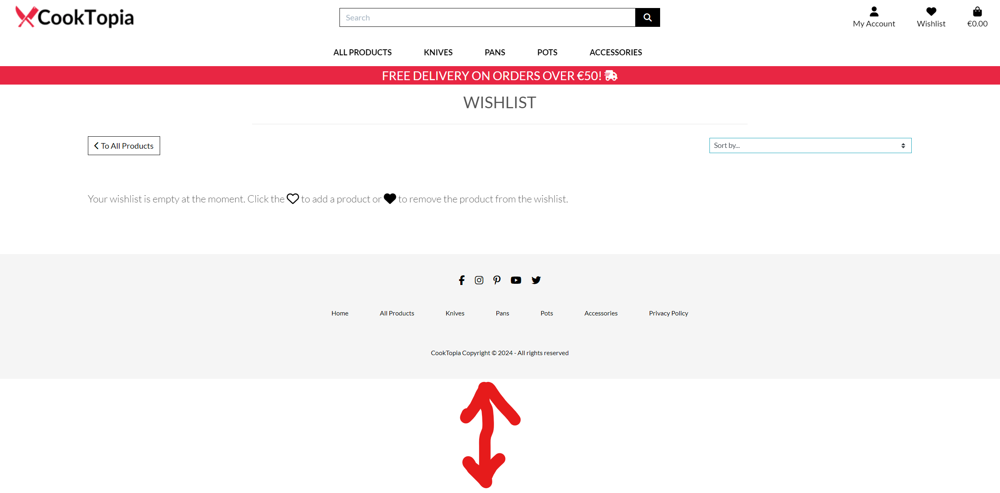
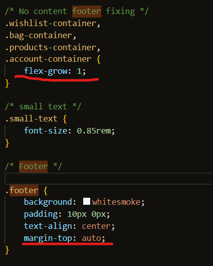

[Back to README.md](/README.md#manual-testing)

# Table of Contents

- [User Story Testing](#user-story-testing)
- [Validations](#validations)
    - [HTML Validation](#html-validation)
    - [CSS Validation](#css-validation)
    - [JavaScript Validation](#javascript-validation)
    - [Python Validation](#python-validation)
    - [Lighthouse Scores](#lighthouse-scores)
    - [Wave Accessibility Score](#wave-accessibility-score)
- [Manual Testing](#manual-testing)
- [Browser Testing](#browser-testing)
- [Fixed Bugs](#fixed-bugs)
- [Present Bugs](#present-bugs)

## User Story Testing

| User Story | Features | Status |
|------------|------------------|------------|
| As a ***customer***, I can ***view listed products***, so that ***I can find something to buy***. | Given the All Products page, the user can easily view all of them in order to buy what he wants. | ✔ |
| As a ***customer***, I can ***view a detailed preview of the product***, so that ***I can get more information about it(price, description, image...)***. | Given the Product Detail page, user can easily see all the information about the product. | ✔ |
| As a ***customer***, I can ***search for the desired product by name or description***, so that ***I can find the specific product I want to buy***. | Given the search-bar within the navbar user can easily search for a desired product. | ✔ |
| As a ***customer***, I can ***see the total cost of the items in my bag***, so that ***I can see if I am getting out of my budget***. | Given the amount status under the shopping bag icon or when the user goes to the shopping bag page, total cost of the items is easily seen. | ✔ |
| As a ***customer***, I can ***sort specific categories of products***, so that ***I can find the cheapest/best-rated product in the given category***. | Given the groups of products within the navbar, as well as badges within the product info, the user can search through desired group of products and sort them as desired through sorting filters. | ✔ |
| As a ***customer***, I can ***sort the list of products***, so that ***I can easily find the best-priced/best-rated one***. | Given the filtering options, this is easily achievable. | ✔ |
| As a ***customer***, I can ***change the quantity of the added items within the shopping bag***, so that ***I can add/remove specific items if desired***. | Given the quantity button within the shopping bag, as well as Update/Remove buttons, the user can easily achieve this. | ✔ |
| As a ***customer***, I can ***easily view the items added to my shopping bag***, so that ***I can have an overview of the all items added and total cost***. | Given the toast messages, whenever the user adds something to the shopping bag, the toast message containing the items and total cost will pop up. The user can also visit shopping bag page to view all of this information as well. | ✔ |
| As a ***customer***, I can ***select the quantity of the products***, so that ***I can be sure to add the right quantity of the products to my shopping bag***. | Given the quantity button under the product image at the All Products page, or quantity button at the Product Detail page, this is easily achievable. | ✔ |
| As a ***customer***, I can ***enter my payment information***, so that ***I can checkout easily without any issues***. | Given the Form at the Checkout page, the user can easily fill out needed fields in order to checkout easily. | ✔ |
| As a ***customer***, I can ***have insight into the order confirmation details***, so that ***I can be sure I made no mistakes***. | After the successful checkout, the user is taken to Thank You page where all of the details are listed. The same order information are being saved within the My Profile->Order History section. | ✔ |
| As a ***customer***, I can ***get registered***, so that ***I can have a personal account/profile***. | Given the Sign Up page/Form the users can easily register at CookTopia site. | ✔ |
| As a ***customer***, I can ***view my profile***, so that ***I can view my order history and save/update shipping/paying information***. | Given the My Profile page where both Delivery Information and Order History sections are the authenticated user can do both things easily. | ✔ |
| As a ***customer***, I can ***receive the confirmation email***, so that ***I can be sure everything went well and keep it for just in case***. | Given the developed mailing system, after successful checkout, the user gets an email with all of those information. | ✔ |
| As a ***customer***, I can ***receive email confirmation after filling in the register form***, so that ***I can verify my account registration was successful***. | After successfully registering at CookTopia, the user gets an confirmation e-mail with confirmation link within. | ✔ |
| As a ***customer***, I can ***add items to wishlist***, so that ***I don't need to search for them all over again when I decide to buy them***. | Given the Wishlist page, and Heart button at Product Detail page, this is easily achievable. | ✔ |
| As a ***customer***, I can ***recover my password***, so that ***I can get access to my account in case I forget my password***. | Given the Forgot Password? button under the Home and Sign In buttons at  Sign In page, user can easily retrieve forgotten password. | ✔ |
| As a ***customer***, I can ***rate the product I already bought***, so that ***I can leave positive/negative feedback***. | Given the Review section at the Product Detail page, and form with options to rate and write a comment, this is easily achievable. | ✔ |
| As a ***admin***, I can ***perform CRUD operations***, so that ***I can manipulate the site as desired***. | Given the Edit and Delete buttons both under the image of the product at the All Products page, as well at Product Detail page, the admins can perform CRUD operations. This is also achievable from the Django Admin Page.| ✔ |
| As a ***customer***, I can ***see if there are any special offers/deals***, so that ***I can enjoy the discounted price and save some money***. | At this point I've decided to skip on this feature. | ❌ |

[Back to Top](#table-of-contents)

## Validations

### HTML Validation

- For my HTML file validation I have used [HTML W3C Validator](https://validator.w3.org/).

### CSS Validation

- For CSS file validation I have used [CSS Jigsaw W3C Validator](https://jigsaw.w3.org/css-validator/).

### JS Validation

- For JS file validation I have used a Static Code Analysis Tool [JS Hint](https://jshint.com/).

### Python Validation

- For Python file validation I have used [CI Python Linter](https://pep8ci.herokuapp.com/).

### Lighthouse Score

### Wave Accessibility Score

## Manual Testing

## Browser Testing

- Complete functionality and layout of the site was tested across next browsers:

  | Browser     | Layout      | Functionality |
  | :---------: | :----------:| :-----------: |
  | Brave       | ✔          | ✔             |
  | Edge        | ✔          | ✔             |
  |  Opera GX   | ✔          | ✔             |
  |    Safari   | ✔          | ✔             |

[Back to Top](#table-of-contents)

### Fixed Bugs

 - #### Bug 1 - Shopping Bag Quantity Button
   - Before fixing, users were able to press the "-" button even after 1(going to 0, -1, -2, and so on). The "+" button was disabled when the number hit 99, but users could enter numbers bigger than 99 by keyboard, so this needed fixing too, as the idea was to set 99 as the biggest possible amount to choose.

 - #### Fix 1
   

   
Quantity Button Fix
   

   
   

- #### Bug 2 - Server Error (500)
  - In the case of non-authenticated user, when the user wanted to open a product_detail page, a 500 Server Error was prompted.
    

    
Server Error (500)
    

    
    

- #### Fix 2
   

   
Server Error (500) Fix
   

   
   

- #### Bug 3 - Footer
  - In the case of a page with no or little content, the footer was jumping up.
    

    
Footer Bug
    

    
    

- #### Fix 3
  - This issue was fixed by setting:
    - min-height: 100vh;(body)
    - flex-grow: 1;(allowing main container on the page to take all extra space)
    - margin-top: auto;(footer)

    

    
Footer Fix
    

    
    

[Back to Top](#table-of-contents)

### Present Bugs
 - There are no known bugs.

[Back to Top](#table-of-contents)
